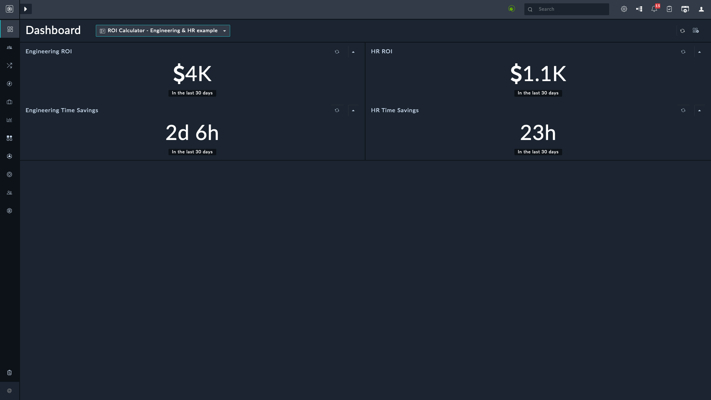

| [Home](https://github.com/fortinet-fortisoar/solution-pack-roi-calculator-usage/blob/release/1.0.0/README.md) |
|--------------------------------------------|

# Usage
- Navigate to the newly created dashboard "ROI Calculator - ENG & HR example". This dashboard will show $0 cost savings for both ENG and HR roles.

- Navigate to the newly added playbooks in the "02 - Use Case - ROI Widget Demo" playbook collection.

- Run the playbooks in the included collection several times each using the playbook execute button inside the playbook designer. 
Each execution of the "Example ENG playbook" adds 30 minutes to the ENG job code, as defined by the roi-eng-30 tag. Each execution of the "Example HR playbook" adds 20 minutes, as defined by the roi-hr-20 tag.

- Return to the dashboard and refresh. The cost savings should populate depending on how many times you run the playbooks.

- The dashboards are configured to display the ROI cost savings at $75/hr for the ENG job code and $50/hr for the HR job code.

- Below is an example after ~100 executions of the ENG playbook and ~50 executions of the HR playbook.

    

## Next steps
Implement your own use case:
- Change the job codes to match your needs
- Add the 'roi' and 'roi-\<JobCode\>-\<minutes\>' tags to your playbooks to estimate how long it takes the JobCode to complete the same task manually (in minutes).
- Change it up by adding multiple tags to a playbook - e.g. roi, roi-eng-20, roi-hr-15 to represent 20 minutes of ENG time and 15 minutes of HR time.
- Change up the dashboard by adding multiple job codes to a single ROI widget configuration to calculate the total of all listed job codes
